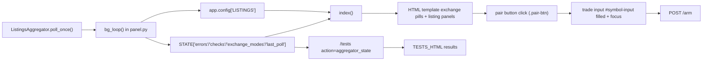

# Scanner/UI Map

## 1) Tests page (route/path, component, state)

### Route/path
- `GET /tests` -> `tests_page()` in `/Users/huseyinbaran/Desktop/Hızlı Alım Satım Botu/multi_exchange_bot/panel.py`
- `POST /tests/run` -> `tests_run()` in `/Users/huseyinbaran/Desktop/Hızlı Alım Satım Botu/multi_exchange_bot/panel.py`

### Page component
- Server-rendered template constant: `TESTS_HTML` in `/Users/huseyinbaran/Desktop/Hızlı Alım Satım Botu/multi_exchange_bot/panel.py`
- The page is not a React/Vue component. It is a Flask `render_template_string(...)` view.

### State management (current)
- Global in-memory app state: `STATE["tests"]`, `STATE["last_action"]`, `STATE["last_poll"]`
- Test catalog metadata: `TEST_CATALOG`
- Executor status snapshot: `exec_state = executor_get_status()`
- Write path:
  - `tests_run()` -> `_run_diagnostic_action(action)` -> `_store_test_result(action, ok, data)` -> `STATE["tests"]`

## 2) Main page exchange pills (component + selection)

### Component
- Main page template constant: `HTML` in `/Users/huseyinbaran/Desktop/Hızlı Alım Satım Botu/multi_exchange_bot/panel.py`
- Pill buttons are rendered in the block that loops `listing_exchanges`:
  - Button class: `.tab-btn.latency-chip`
  - Attributes: `data-tab`, `data-latency-ex`, `data-ms`

### Selection behavior
- Client-side JS in the same `HTML` template:
  - `const tabs = document.querySelectorAll('.tab-btn');`
  - `tab.addEventListener('click', ...)` toggles `.active` on tabs and `#panel-{exchange}` sections
- Latency probe tie-in:
  - Hidden form `#probe-form` posts to `POST /probe-latency`
  - Selected exchange/symbol are copied into hidden fields before submit

## 3) Trade pair input (component + state location)

## Main quick-trade pair input
- Component location: `id="symbol-input"` in `HTML` template (`/Users/huseyinbaran/Desktop/Hızlı Alım Satım Botu/multi_exchange_bot/panel.py`)
- Submit path: `POST /arm`
- State source:
  - Initial value from server: `last_order["symbol"]`
  - Runtime value in DOM (`symbolInput`)
  - Suggestions via `pair_options_map` -> `pairOptionsByExchange` -> datalist `#quick-pair-list`

## Real-trade test pair input
- Route/page: `GET /real-tests` -> template `REAL_TRADE_TEST_HTML`
- Component: `id="pair-input"`
- Submit paths: `POST /real-tests/buy`, `POST /real-tests/sell`, `POST /real-tests/run`
- JS state: `pairEl` + `pairOptionsByExchange` for exchange-specific pair list behavior

## 4) Current scanner structure (files, classes, call interface)

### Core scanner
- File: `/Users/huseyinbaran/Desktop/Hızlı Alım Satım Botu/multi_exchange_bot/bot/listings_agg.py`
- Class: `ListingsAggregator`
- Main public method: `poll_once() -> (out, errs)`

### Scanner dependencies
- Source URLs: `/Users/huseyinbaran/Desktop/Hızlı Alım Satım Botu/multi_exchange_bot/bot/web/sources.py` (`SOURCES`)
- HTML parser/filter: `/Users/huseyinbaran/Desktop/Hızlı Alım Satım Botu/multi_exchange_bot/bot/web/parsers.py` (`parse_listings`, `likely_listing`)
- Time extraction: `/Users/huseyinbaran/Desktop/Hızlı Alım Satım Botu/multi_exchange_bot/bot/parsing/time_extract.py`

### Scanner internal responsibilities (current)
- Multi-exchange source strategy:
  - `PRIMARY_SOURCE` (`api_announcement`, `symbol_diff`, `web_fallback`)
  - `SOURCE_PRIORITY` for dedupe precedence
- Strict listing-only filtering:
  - `_is_listing_only(...)`
  - `_strict_listing_item(...)`
- Fetch path:
  - `_fetch_primary_items(...)`
  - `_fetch_symbol_diff_fallback(...)`
  - `_fetch_web_fallback_items(...)`
- Time normalization path:
  - `_normalize_time_meta(...)`
- Result shaping:
  - `_prioritize_dedupe(...)`
  - `first_seen`, `url_meta`, `items`, `exchange_state`

## 5) How scanner output reaches UI

1. App startup creates scanner instance:
- `agg = ListingsAggregator()` in `/Users/huseyinbaran/Desktop/Hızlı Alım Satım Botu/multi_exchange_bot/panel.py`

2. Background polling loop:
- `bg_loop()` calls `res, errs = agg.poll_once()`
- Writes:
  - `app.config["LISTINGS"] = res`
  - `STATE["errors"] = errs`
  - `STATE["checks"]`
  - `STATE["exchange_modes"] = agg.exchange_state`
  - `STATE["last_poll"]`

3. Main page read/render:
- `index()` reads `app.config["LISTINGS"]` and `STATE[...]`
- Applies `filter_out_expired(...)`
- Renders exchange panels, source badge, degraded mode, and listing cards

4. Tests page scanner visibility:
- Test action `aggregator_state` reads scanner surface state from:
  - `STATE["exchange_modes"]`
  - `STATE["errors"]`
  - `STATE["checks"]`

## 6) Current data-flow map

## 7) Acceptance check against requested discovery

- Tests page route/path found: yes (`/tests`, `/tests/run`)
- Tests page component identified: yes (`TESTS_HTML`)
- Tests page state identified: yes (`STATE["tests"]` + helpers)
- Main page pill component/selection identified: yes (`.tab-btn.latency-chip` + JS `.active` toggling)
- Trade pair input component/state identified: yes (`#symbol-input` on main, `#pair-input` on real-tests)
- Scanner structure/interface identified: yes (`ListingsAggregator.poll_once()` + `bg_loop()` integration)
